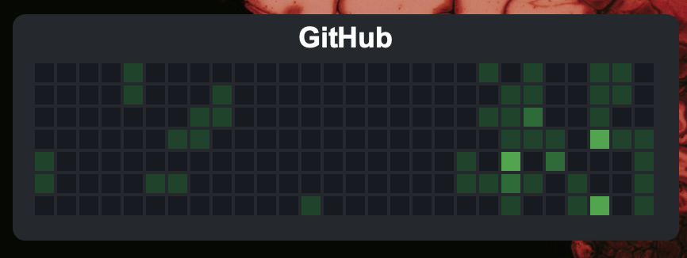

# GitHub Contributions Graph Widget for Übersicht

A dynamic GitHub contributions graph widget for Übersicht, styled for dark mode and designed to scale dynamically based on the widget's dimensions.


*Replace this placeholder with a screenshot of your widget in action!*

## Features
- Displays your recent GitHub contribution graph.
- Automatically adjusts to fit the widget's dimensions.
- Dark mode compatible.

---

## Requirements
1. **GitHub Token**: You’ll need a personal access token from GitHub. You can generate one from your GitHub account under **Settings > Developer settings > Personal access tokens**. Ensure it has the `read:user` and `repo` scopes (for public and private contributions).
2. **GitHub Username**: Your GitHub username to fetch contributions.

---

## Installation Guide

1. **Install Übersicht**
   If you don’t already have Übersicht installed, download it from [Übersicht's website](http://tracesof.net/uebersicht/).

2. **Clone or Download the Widget**
   Clone this repository into the `~/Library/Application Support/Übersicht/widgets/` directory (or wherever your Übersicht widgets are stored).

3. **Set Up Token and Username**
   - Open the `index.jsx` file.
   - Replace the placeholders for `githubUsername` and `githubToken` with your GitHub username and token, respectively:
     ```javascript
     const githubUsername = "your-github-username";
     const githubToken = "your-github-token";
     ```

4. **Start Übersicht**
   Launch Übersicht, and the widget will appear on your desktop.

---

## Configuration
You can customize the widget's:
- **Position**: Adjust `widgetLeft` and `widgetTop` in `index.jsx`.
- **Size**: Modify `widgetWidth` and `widgetHeight` to fit your desired dimensions.
- **Update Frequency**: Change the `refreshFrequency` (in milliseconds).

---
Enjoy your stylish GitHub contributions graph right on your desktop!
